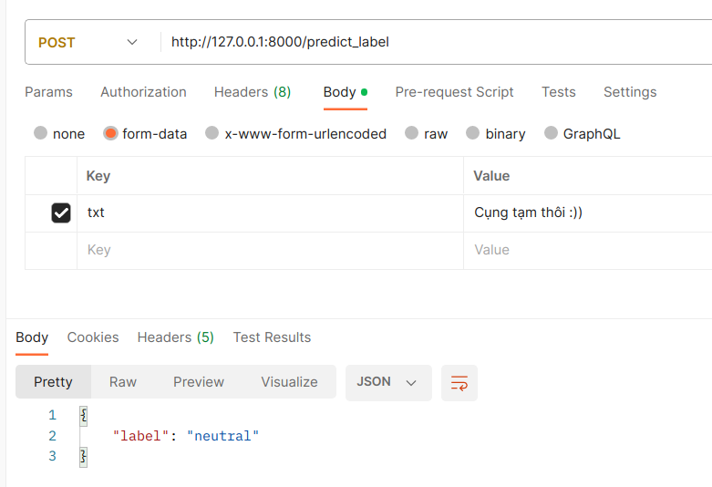

# Sentiment analysis

Sentiment analysis of students' feedback for HIT club leaders with 3 labels ('negative', 'neutral', 'positive').

Achieved 93.5% F1-score accuracy in Vietnamese students feed-back dataset in HuggingFace.
## Run

```bash
python flask_api.py
```

## Api

- txt: string type, students' feedback.